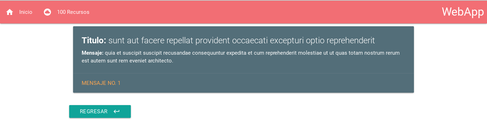
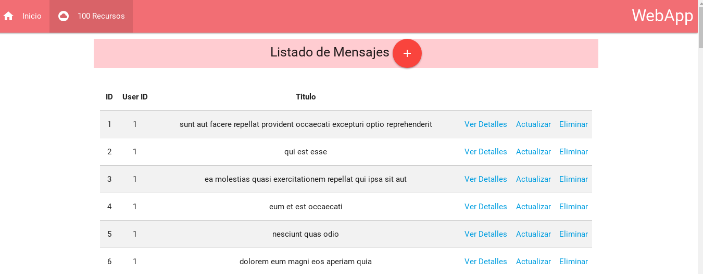
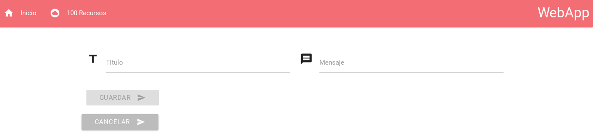

# Webapp

Es una WebApp que fue creada con angular 4  para consumir los protocols HTTP que estan disponibles en la APIRESTful de JSONPlaceholder

## Caracteristicas que se podran encontrar.
- app.routing.ts
- import { Http, Response, Headers, RequestOptions, RequestMethod  } from '@angular/http';
- import { Observable }              from 'rxjs/Observable';
- utilizacion de los metodos get,post,put,delete con angular 4
- Validaciones nativas de Validaciones HTML5 interactuando con angular 4
- Creación de Modelos para el manejo de objetos Mensajes.
- Materialize y Materialize Icons
- Formuarios de creación y edición
- Consumo de JSON Server

## Imagenes de Aplicación.

